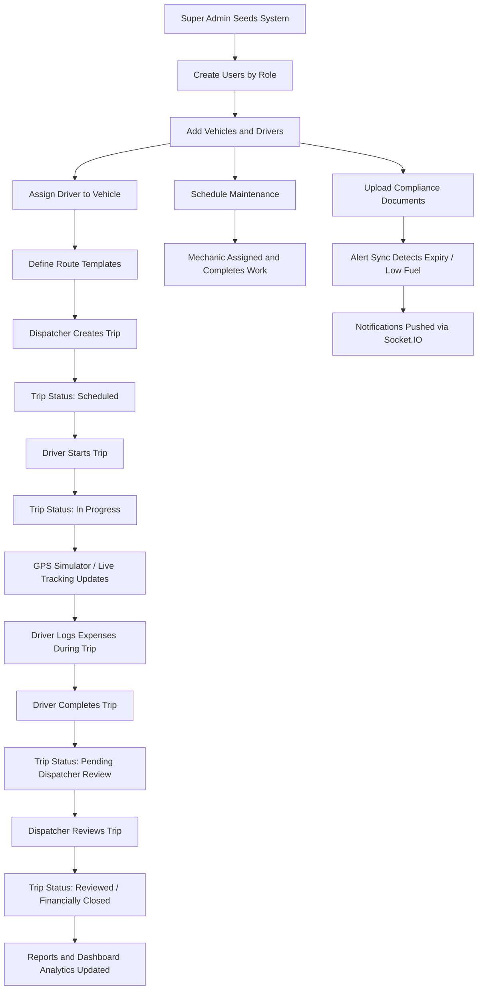
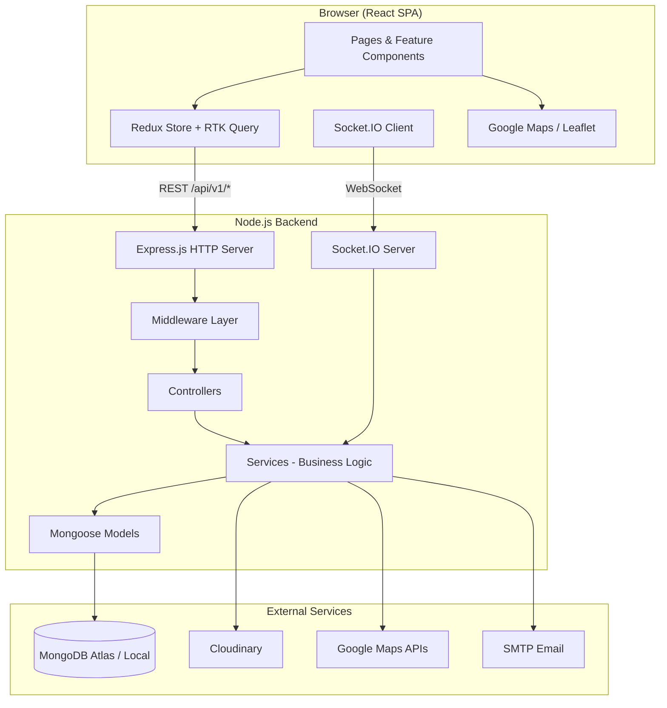
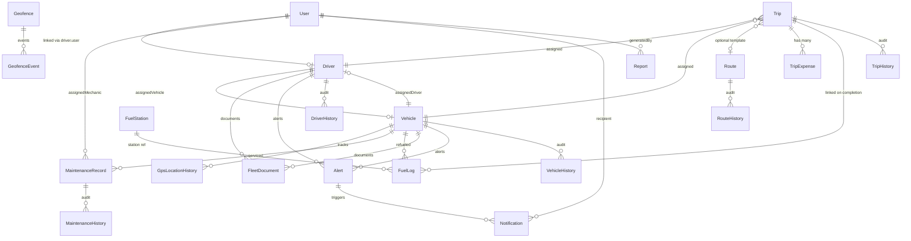
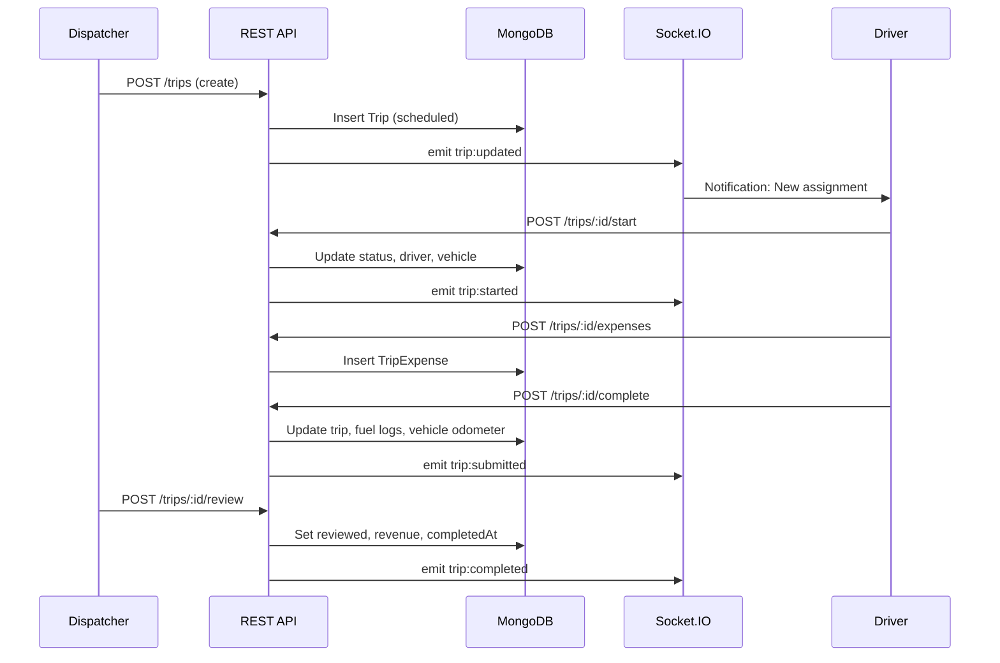
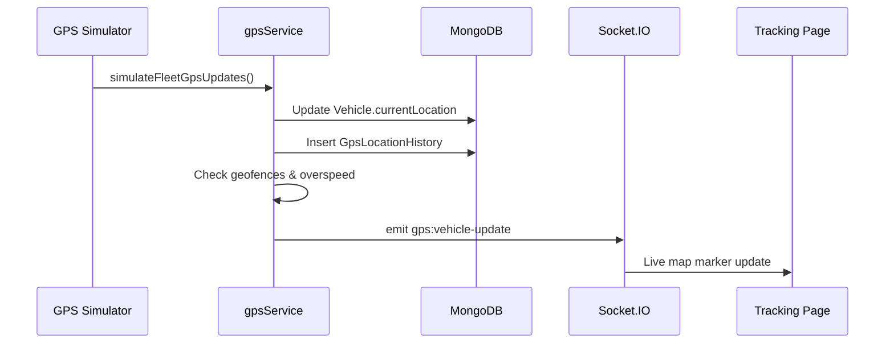

# Fleet Management System (FleetOps)

**Enterprise-Grade Fleet Operations Platform**

| Attribute | Detail |
|-----------|--------|
| **Project Name** | Fleet Management System (branded as **FleetOps** in the UI) |
| **Version** | 1.0.0 |
| **Architecture** | Monorepo — React SPA + Node.js REST API + MongoDB + Socket.IO |
| **Repository Root** | `Fleet_Management_System/` |
| **API Base URL** | `http://localhost:5000/api/v1` |
| **Frontend URL** | `http://localhost:5173` |

---

## Table of Contents

1. [Project Overview](#1-project-overview)
2. [Problem Statement](#2-problem-statement)
3. [Objectives](#3-objectives)
4. [Key Features and Functionalities](#4-key-features-and-functionalities)
5. [Complete System Workflow](#5-complete-system-workflow)
6. [Architecture Explanation](#6-architecture-explanation)
7. [Technology Stack with Justification](#7-technology-stack-with-justification)
8. [Folder Structure and Directory Purpose](#8-folder-structure-and-directory-purpose)
9. [Database Design and Schema Explanation](#9-database-design-and-schema-explanation)
10. [API Endpoints and Functionality](#10-api-endpoints-and-functionality)
11. [User Roles and Permissions](#11-user-roles-and-permissions)
12. [Core Modules — Detailed Explanations](#12-core-modules--detailed-explanations)
13. [Implementation Details and Business Logic](#13-implementation-details-and-business-logic)
14. [Screens and Modules Explanation](#14-screens-and-modules-explanation)
15. [Data Flow and Process Flow](#15-data-flow-and-process-flow)
16. [Security Features](#16-security-features)
17. [Challenges Faced and Solutions](#17-challenges-faced-and-solutions)
18. [Assumptions and Limitations](#18-assumptions-and-limitations)
19. [Future Enhancements](#19-future-enhancements)
20. [Installation and Setup Instructions](#20-installation-and-setup-instructions)
21. [How to Run the Project](#21-how-to-run-the-project)
22. [Testing Approach](#22-testing-approach)
23. [Conclusion](#23-conclusion)

---

## 1. Project Overview

The **Fleet Management System** is a full-stack web application designed to digitize and centralize logistics and fleet operations for transport companies. It provides a unified platform where administrators, dispatchers, drivers, and mechanics can manage vehicles, drivers, trips, routes, fuel consumption, maintenance work orders, compliance documents, alerts, and operational reports — all from a role-aware dashboard with real-time GPS tracking.

The application is branded **FleetOps** in the user interface and follows a modern **Single Page Application (SPA)** architecture on the frontend, backed by a **RESTful API** and **WebSocket** layer for live updates.

### What Makes This Project Enterprise-Ready

- **Role-Based Access Control (RBAC)** with five distinct user roles and granular permissions
- **JWT authentication** with refresh-token rotation via httpOnly cookies
- **Real-time updates** via Socket.IO for GPS, trips, alerts, and dashboard activity
- **Google Maps integration** with mock fallback for development without API keys
- **Cloudinary** integration for document and image uploads
- **Audit trails** via history collections for vehicles, drivers, routes, trips, and maintenance
- **Soft delete** pattern across core entities
- **Comprehensive testing** — unit tests and integration test scripts per module

---

## 2. Problem Statement

Transport and logistics companies face significant operational challenges when managing fleet resources manually or across disconnected tools:

| Challenge | Impact |
|-----------|--------|
| **Fragmented data** | Vehicle, driver, trip, and maintenance records stored in spreadsheets or siloed systems |
| **No real-time visibility** | Dispatchers cannot see live vehicle locations, active trips, or geofence violations |
| **Compliance risk** | Expired licenses, insurance, registration, and fitness certificates go unnoticed until penalties occur |
| **Inefficient trip closure** | Drivers submit expenses informally; revenue and cost reconciliation is manual |
| **Reactive maintenance** | Overdue service schedules cause breakdowns and unplanned downtime |
| **Role confusion** | Different stakeholders (admin, dispatcher, driver, mechanic) need different views but share one system |
| **Delayed alerting** | Low fuel, overspeed, document expiry, and maintenance due events are discovered too late |

### Solution Summary

FleetOps consolidates all fleet operations into one secure, permission-controlled platform with automated alert generation, live tracking, structured trip lifecycle management, and exportable analytics — reducing manual coordination and improving operational efficiency.

---

## 3. Objectives

### Primary Objectives

1. **Centralize fleet master data** — vehicles, drivers, routes, fuel stations, and documents in one MongoDB-backed system
2. **Enable end-to-end trip management** — from scheduling through driver execution, expense logging, dispatcher review, and financial closure
3. **Provide real-time operational awareness** — live GPS positions, active trips, alerts, and dashboard KPIs via Socket.IO
4. **Enforce access control** — each role sees only the modules and actions relevant to their job function
5. **Automate compliance monitoring** — sync alerts for low fuel, document expiry, insurance expiry, and overdue maintenance
6. **Support data-driven decisions** — dashboards, analytics panels, and CSV report exports across all modules

### Secondary Objectives

- Offer Google Maps-powered route planning with distance, duration, traffic, and polyline visualization
- Link driver user accounts to driver fleet records for personalized driver dashboards
- Maintain complete audit history for accountability and troubleshooting
- Provide seed scripts for demo data and Super Admin bootstrap for first-time setup

---

## 4. Key Features and Functionalities

### 4.1 Authentication and User Management

| Feature | Description |
|---------|-------------|
| User registration | Self-registration with email OTP verification (default role: Dispatcher) |
| Login / Logout | JWT access token + httpOnly refresh cookie |
| Password recovery | Forgot password → OTP → reset password flow |
| Admin user CRUD | Super Admin creates users with any role; admin-created users skip OTP |
| Profile management | Users can view/update profile and change password |

### 4.2 Fleet Master Data

| Module | Capabilities |
|--------|-------------|
| **Vehicles** | CRUD, driver assignment, image upload (Cloudinary), document expiry tracking, CSV export, history |
| **Drivers** | CRUD, vehicle assignment, avatar upload, document attachments, performance score, CSV export, history |
| **Routes** | Route templates with multi-stop waypoints, Google Directions integration, optimization, duplication, traffic preview |

### 4.3 Operations

| Module | Capabilities |
|--------|-------------|
| **Trips** | Create, assign vehicle/driver, start, complete, cancel, review; expense tracking; consignment status |
| **Live Trip Updates** | Driver-specific page for active trip management, expense entry, fuel logging at completion |
| **Trip Review** | Dispatcher/Fleet Manager reviews submitted trips, sets revenue, closes financially |
| **GPS Tracking** | Live vehicle map, route history, geofence CRUD, enter/exit events, overspeed detection |
| **Maps** | Dedicated maps page with tracking visualization |

### 4.4 Support Functions

| Module | Capabilities |
|--------|-------------|
| **Fuel** | Fuel log CRUD, fuel station management, analytics, mileage tracking, trip-linked fuel entries |
| **Maintenance** | Work orders, mechanic assignment, start/complete workflow, parts tracking, attachment upload |
| **Documents** | Fleet/vehicle/driver document upload, expiry tracking, expiring-soon alerts, download |
| **Alerts** | System-generated and manual alerts; sync engine; read/unread; bulk delete; analytics |
| **Notifications** | Per-user notification inbox linked to alerts and trip events |
| **Reports** | Fleet summary, financial, operational reports; module-specific CSV exports |
| **Admin** | User management, fleet settings, roles/permissions overview |

### 4.5 Real-Time and Analytics

- Socket.IO rooms for GPS, alerts, trips, dashboard, and per-user notifications
- Dashboard with stat cards, Recharts visualizations, recent activities, live vehicles panel
- Role-specific dashboards: Fleet (managers/dispatchers), Driver, Mechanic

---

## 5. Complete System Workflow

### 5.1 End-to-End Operational Workflow



### 5.2 Authentication Workflow

```
Browser → POST /api/v1/auth/login { email, password }
       → Backend validates credentials, isActive, isEmailVerified
       → Returns JWT access token in response body
       → Sets refresh token in httpOnly cookie
       → Frontend stores access token in memory/localStorage
       → GET /api/v1/auth/me loads user + permissions
       → Redirect to /dashboard

On 401 API response:
       → POST /api/v1/auth/refresh-token (cookie sent automatically)
       → New access token issued → original request retried
```

### 5.3 Trip Lifecycle States

| Status | Meaning | Who Acts |
|--------|---------|----------|
| `scheduled` | Trip created, awaiting start | Dispatcher / Driver |
| `in_progress` | Driver started trip; vehicle ignition on | Driver |
| `pending_dispatcher_review` | Driver submitted completion data | Dispatcher / Fleet Manager |
| `reviewed` | Revenue confirmed; trip financially closed | Dispatcher / Fleet Manager |
| `completed` | Legacy/alternate closed state (included in financial reports) | System |
| `cancelled` | Trip cancelled before or during execution | Dispatcher / authorized roles |

---

## 6. Architecture Explanation

### 6.1 High-Level Architecture



### 6.2 Backend Layered Architecture

| Layer | Location | Responsibility |
|-------|----------|----------------|
| **Entry Point** | `backend/server.js` | Express app, HTTP server, Socket.IO, middleware stack, MongoDB connection, GPS simulator |
| **Routes** | `backend/routes/*.js` | URL mapping, middleware chaining, permission guards |
| **Controllers** | `backend/controllers/*.js` | Request/response handling, input extraction |
| **Services** | `backend/services/*.js` | Business logic, validations, side effects, socket emissions |
| **Models** | `backend/models/*.js` | Mongoose schemas, indexes, virtuals, hooks |
| **Validators** | `backend/validators/*.js` | express-validator rules |
| **Middleware** | `backend/middleware/*.js` | Auth, authorization, upload, rate limiting, error handling |
| **Utilities** | `backend/utils/*.js` | JWT, pagination, CSV export, geo calculations, OTP generation |
| **Socket** | `backend/socket/*.js` | Real-time event handlers and room subscriptions |
| **Jobs** | `backend/jobs/gpsSimulator.js` | Periodic mock GPS updates for development/demo |

### 6.3 Frontend Architecture

| Layer | Location | Responsibility |
|-------|----------|----------------|
| **Entry** | `frontend/src/main.jsx` | React bootstrap |
| **App Shell** | `frontend/src/App.jsx` | Router, providers (Redux, Theme, Google Maps, Snackbar) |
| **Layouts** | `frontend/src/layouts/` | `DashboardLayout` (sidebar, app bar), `AuthLayout` |
| **Pages** | `frontend/src/pages/` | Route-level screen components |
| **Features** | `frontend/src/features/` | Module-specific UI components, dialogs, drawers, utils |
| **Redux API** | `frontend/src/redux/api/` | RTK Query slices per domain module |
| **Hooks** | `frontend/src/hooks/` | `useAuth`, `usePermissions`, `useGpsSocket` |
| **Contexts** | `frontend/src/contexts/` | Theme mode, Google Maps provider |
| **Route Guards** | `frontend/src/components/common/` | `ProtectedRoute`, `GuestRoute`, `PermissionRoute`, `RealtimeSync` |

### 6.4 Request Flow (Example: List Vehicles)

```
GET /api/v1/vehicles?page=1&limit=10
  → globalLimiter (rate limit)
  → protect (JWT validation → req.user, req.userPermissions)
  → requirePermission(VIEW_VEHICLES)
  → listVehiclesValidator + validate
  → vehicleController.getVehicles
  → vehicleService.getVehicles (pagination, filters, soft-delete query)
  → Vehicle.find() → MongoDB
  → JSON { success, data, pagination }
```

---

## 7. Technology Stack with Justification

### 7.1 Frontend

| Technology | Version | Justification |
|------------|---------|---------------|
| **React** | 18.x | Component-based UI, large ecosystem, ideal for complex dashboards |
| **Vite** | 6.x | Fast dev server and optimized production builds |
| **Redux Toolkit + RTK Query** | 2.x | Centralized state, automatic caching, tag invalidation, token refresh interceptor |
| **Material UI (MUI)** | 6.x | Professional enterprise UI components, DataGrid, Date Pickers |
| **React Router** | 7.x | Declarative routing with nested layouts and route guards |
| **React Hook Form + Yup** | — | Performant forms with schema validation |
| **Recharts** | 2.x | Dashboard chart visualizations |
| **Socket.IO Client** | 4.x | Real-time GPS, alerts, trip, and notification updates |
| **@react-google-maps/api + Leaflet** | — | Google Maps when configured; Leaflet fallback |
| **Framer Motion** | — | UI animations and transitions |
| **Vitest + Testing Library** | — | Frontend unit testing |

### 7.2 Backend

| Technology | Version | Justification |
|------------|---------|---------------|
| **Node.js** | 18+ | JavaScript full-stack consistency, non-blocking I/O for real-time workloads |
| **Express.js** | 4.x | Mature, minimal HTTP framework with extensive middleware support |
| **MongoDB + Mongoose** | 8.x | Flexible document schema for varied fleet entities; geospatial indexes for GPS |
| **Socket.IO** | 4.x | Bidirectional real-time communication with room-based subscriptions |
| **JWT (jsonwebtoken)** | — | Stateless access tokens with short expiry |
| **bcryptjs** | — | Secure password hashing (12 rounds) |
| **express-validator** | — | Declarative input validation |
| **Helmet + CORS + mongo-sanitize + xss-clean** | — | Security hardening |
| **express-rate-limit** | — | Brute-force and abuse protection |
| **Multer + Cloudinary** | — | File upload handling and cloud storage |
| **Nodemailer** | — | OTP and password reset emails |
| **PDFKit + ExcelJS** | — | Present in dependencies for future export formats (currently CSV primary) |
| **Node built-in test runner** | — | Backend unit tests |

### 7.3 Infrastructure and DevOps

| Tool | Purpose |
|------|---------|
| **concurrently** | Run frontend and backend dev servers simultaneously |
| **nodemon** | Auto-restart backend on file changes |
| **MongoDB Atlas** | Cloud database (local MongoDB also supported) |
| **dotenv** | Environment variable management |

---

## 8. Folder Structure and Directory Purpose

```
Fleet_Management_System/
├── package.json                 # Root scripts: install:all, dev, test, build
├── README.md                    # Developer quick-start guide
├── project_README.md            # This comprehensive documentation
│
├── backend/
│   ├── server.js                # Application entry point
│   ├── config/
│   │   ├── index.js             # Centralized config (port, JWT, rate limits)
│   │   └── database.js          # MongoDB connection
│   ├── constants/
│   │   ├── roles.js             # RBAC roles and permissions (source of truth)
│   │   ├── enums.js             # Status enums across all modules
│   │   └── socketEvents.js      # Socket.IO event names and rooms
│   ├── routes/                  # Express route definitions (16 route files)
│   ├── controllers/             # HTTP request handlers (15 controllers)
│   ├── services/                # Business logic (26 service files)
│   ├── models/                  # Mongoose schemas (23 models)
│   ├── middleware/              # auth, authorize, validate, upload, rateLimiters, errorHandler
│   ├── validators/              # express-validator schemas per module
│   ├── utils/                   # JWT, pagination, CSV, geo, OTP, trip access helpers
│   ├── socket/                  # Socket.IO initialization and domain handlers
│   ├── jobs/
│   │   └── gpsSimulator.js      # Periodic mock GPS update job
│   ├── scripts/
│   │   ├── seed.js              # Super Admin bootstrap
│   │   ├── seed-dashboard.js    # Demo fleet data
│   │   ├── setup-google-maps.js # Maps API key setup helper
│   │   ├── test-*.js            # Integration test scripts per module
│   │   └── run-all-tests.js     # Integration test runner
│   ├── tests/unit/              # Node.js native unit tests
│   └── uploads/                 # Local static file serving (fallback)
│
└── frontend/
    ├── index.html               # HTML shell
    ├── vite.config.js           # Vite configuration
    └── src/
        ├── main.jsx             # React entry
        ├── App.jsx              # Routes and global providers
        ├── constants/           # Frontend enums and permissions (mirrors backend)
        ├── layouts/             # DashboardLayout, AuthLayout
        ├── pages/               # 23 page components (auth, dashboard, modules)
        ├── features/            # 79+ feature components organized by domain
        ├── components/common/   # Shared: route guards, skeletons, RealtimeSync
        ├── contexts/            # ThemeContext, GoogleMapsProvider
        ├── hooks/               # useAuth, usePermissions, useGpsSocket
        ├── redux/
        │   ├── store.js         # Redux store configuration
        │   ├── slices/          # authSlice
        │   └── api/             # 15 RTK Query API slices
        ├── services/            # socketManager
        └── utils/               # formatters, validationSchemas, tokenStorage
```

---

## 9. Database Design and Schema Explanation

### 9.1 Entity Relationship Overview



### 9.2 Core Collections

#### User (`users`)

| Field | Type | Purpose |
|-------|------|---------|
| firstName, lastName, email, password | String | Identity and authentication |
| role | Enum | `super_admin`, `fleet_manager`, `dispatcher`, `driver`, `mechanic` |
| isEmailVerified, isActive | Boolean | Access gates |
| otp | Subdocument | Email verification / password reset OTP |
| refreshTokens | Array | Rotating refresh token store (max 5) |
| isDeleted, deletedAt | Soft delete | Account deactivation |

#### Vehicle (`vehicles`)

| Field | Type | Purpose |
|-------|------|---------|
| vehicleNumber, vin, model, manufacturer, year | Identity | Unique vehicle identification |
| status | Enum | `active`, `inactive`, `maintenance`, `retired` |
| fuelType, fuelLevel, odometer | Operational | Fuel and mileage tracking |
| assignedDriver | ObjectId → Driver | Current driver assignment |
| documentExpiry | Subdocument | insurance, registration, fitness, emission, permit dates |
| currentLocation | GeoJSON Point | Live GPS coordinates (2dsphere index) |
| speed, heading, ignition, engineStatus | Telemetry | Real-time tracking state |
| images | Array | Cloudinary image references |

#### Driver (`drivers`)

| Field | Type | Purpose |
|-------|------|---------|
| user | ObjectId → User | Links login account to fleet record |
| employeeId, licenseNumber, licenseExpiry | Compliance | Driver identification |
| status | Enum | `available`, `on_trip`, `off_duty`, `suspended` |
| assignedVehicle | ObjectId → Vehicle | Current vehicle assignment |
| performanceScore | Number | 0–100 performance metric |
| documents | Array | License, medical, ID attachments |
| emergencyContact | Subdocument | Safety contact info |

#### Trip (`trips`)

| Field | Type | Purpose |
|-------|------|---------|
| tripNumber | String | Unique trip identifier (auto-generated) |
| status | Enum | Full lifecycle states |
| driver, vehicle, route | ObjectId refs | Assignment |
| origin, destination | Location subdocs | Address + lat/lng |
| scheduledAt, startedAt, completedAt | Dates | Timeline |
| distance, fuelUsed, revenue, expenses | Numbers | Operational and financial metrics |
| expenseBreakdown | Subdocument | fuel, tolls, maintenance, food, lodging, other |
| consignment | Subdocument | Reference number, status, notes |
| reviewedBy, reviewNotes | Review metadata | Dispatcher closure |

#### Route (`routes`)

| Field | Type | Purpose |
|-------|------|---------|
| routeNumber, name, status | Identity | Route template management |
| origin, destination | Location | Endpoints |
| stops, optimizedStops | Array | Multi-stop waypoints with sequence and type |
| pathCoordinates | Array | Encoded route polyline points |
| totalDistanceMeters, estimatedDurationMinutes | Metrics | From Google Directions |
| trafficLevel, trafficDelayMinutes | Traffic | Live traffic integration |

#### MaintenanceRecord (`maintenancerecords`)

| Field | Type | Purpose |
|-------|------|---------|
| workOrderNumber | String | Unique work order ID |
| vehicle, type, status, priority | Core | preventive/repair/inspection lifecycle |
| assignedMechanic, assignedMechanics | User refs | Mechanic assignment |
| parts, attachments | Arrays | Parts used and completion documents |
| scheduledDate, completedDate | Dates | Scheduling and completion |

#### FuelLog (`fuellogs`) and FuelStation (`fuelstations`)

- **FuelLog**: quantity, cost, pricePerUnit, odometer, mileage, fuelType, optional trip/tripExpense/station links
- **FuelStation**: name, brand, address, GeoJSON location, supported fuelTypes, status

#### FleetDocument (`fleetdocuments`)

- Supports entity types: `vehicle`, `driver`, `fleet`
- Tracks issueDate, expiryDate, status (`active`, `expiring_soon`, `expired`, `archived`)
- Cloudinary fileUrl/publicId for storage

#### Alert (`alerts`) and Notification (`notifications`)

- **Alert**: fleet-wide alert records (type, severity, vehicle/driver refs, isRead)
- **Notification**: per-user delivery of alert/trip/system events

#### Geofence (`geofences`) and GeofenceEvent (`geofenceevents`)

- Circle or polygon geofences with enter/exit alert configuration
- Events logged when vehicles cross boundaries

#### GpsLocationHistory (`gpslocationhistories`)

- Time-series GPS snapshots per vehicle with speed, heading, fuel, ignition

#### Supporting Collections

| Collection | Purpose |
|------------|---------|
| `activities` | Dashboard recent activity feed |
| `vehiclehistories`, `driverhistories`, `triphistories`, `routehistories`, `maintenancehistories` | Audit trails |
| `tripexpenses` | Individual expense line items during trips |
| `fleetsettings` | Singleton fleet configuration document |
| `reports` | Report generation history metadata |

### 9.3 Indexing Strategy

- **Text indexes** on vehicleNumber, driver names, route names for search
- **2dsphere indexes** on vehicle currentLocation, geofence center/polygon, fuel station location
- **Compound indexes** on status + isDeleted for filtered list queries
- **Date indexes** on trip scheduledAt, fuel loggedAt, document expiryDate

### 9.4 Soft Delete Pattern

Core entities (Vehicle, Driver, Trip, Route, Maintenance, FuelLog, FleetDocument, User) implement:

```javascript
// Applied via schemaHelpers.js
isDeleted: { type: Boolean, default: false }
deletedAt: { type: Date, default: null }
// Query middleware excludes isDeleted: true records by default
```

---

## 10. API Endpoints and Functionality

**Base URL:** `/api/v1`  
**Authentication:** Bearer token in `Authorization` header (except public auth routes)  
**Health Check:** `GET /health` (no auth, excluded from rate limiting)

### 10.1 Authentication (`/auth`)

| Method | Endpoint | Auth | Description |
|--------|----------|------|-------------|
| POST | `/register` | Public | Register new user; sends OTP |
| POST | `/login` | Public | Login; returns access token + refresh cookie |
| POST | `/refresh-token` | Cookie | Refresh access token |
| POST | `/logout` | Protected | Invalidate refresh tokens |
| POST | `/verify-otp` | Public | Verify email OTP |
| POST | `/resend-otp` | Public | Resend verification OTP |
| POST | `/forgot-password` | Public | Send password reset OTP |
| POST | `/reset-password` | Public | Reset password with OTP |
| GET | `/me` | Protected | Current user + permissions |
| PATCH | `/change-password` | Protected | Change password |

### 10.2 Dashboard (`/dashboard`)

| Method | Endpoint | Permission | Description |
|--------|----------|------------|-------------|
| GET | `/overview` | Any dashboard access | Combined dashboard payload |
| GET | `/summary` | — | KPI summary stats |
| GET | `/charts` | — | Chart data (trips, fuel, financial, vehicle status) |
| GET | `/activities` | — | Recent activity feed |
| GET | `/alerts` | — | Dashboard alert summary |
| GET | `/live-vehicles` | — | Live vehicle positions |

### 10.3 Vehicles (`/vehicles`)

| Method | Endpoint | Permission | Description |
|--------|----------|------------|-------------|
| GET | `/` | view_vehicles | Paginated list with filters |
| GET | `/stats` | view_vehicles | Vehicle statistics |
| GET | `/export` | view_vehicles | CSV export |
| GET | `/:id` | view_vehicles | Single vehicle detail |
| GET | `/:id/history` | view_vehicles | Audit history |
| GET | `/meta/drivers` | assign_vehicles | Available drivers for assignment |
| POST | `/` | create_vehicles | Create vehicle |
| PATCH | `/:id` | update_vehicles | Update vehicle |
| DELETE | `/:id` | delete_vehicles | Soft delete |
| POST | `/:id/assign-driver` | assign_vehicles | Assign driver |
| DELETE | `/:id/assign-driver` | assign_vehicles | Unassign driver |
| POST | `/:id/images` | update_vehicles | Upload image (multipart) |
| DELETE | `/:id/images/:publicId` | update_vehicles | Delete image |

### 10.4 Drivers (`/drivers`)

| Method | Endpoint | Permission | Description |
|--------|----------|------------|-------------|
| GET | `/` | view_drivers | Paginated list |
| GET | `/stats` | view_drivers | Driver statistics |
| GET | `/export` | view_drivers | CSV export |
| GET | `/:id` | view_drivers | Driver detail |
| GET | `/:id/history` | view_drivers | Audit history |
| GET | `/meta/vehicles` | assign_drivers | Available vehicles |
| POST | `/` | create_drivers | Create driver |
| PATCH | `/:id` | update_drivers | Update driver |
| DELETE | `/:id` | delete_drivers | Soft delete |
| POST | `/:id/assign-vehicle` | assign_drivers | Assign vehicle |
| DELETE | `/:id/assign-vehicle` | assign_drivers | Unassign vehicle |
| POST | `/:id/avatar` | update_drivers | Upload avatar |
| POST | `/:id/documents` | update_drivers | Upload driver document |
| DELETE | `/:id/documents/:documentId` | update_drivers | Delete document |

### 10.5 Trips (`/trips`)

| Method | Endpoint | Permission | Description |
|--------|----------|------------|-------------|
| GET | `/` | view_trips | Paginated trip list |
| GET | `/stats` | view_trips | Trip statistics |
| GET | `/analytics` | view_trips | Trip analytics |
| GET | `/pending-review` | review_trips | Trips awaiting review |
| GET | `/upcoming` | view_trips | Upcoming scheduled trips |
| GET | `/me/driver` | view_trips | Linked driver profile for logged-in driver |
| GET | `/me/active` | view_trips | Driver's active trip |
| GET | `/me/scheduled` | view_trips | Driver's scheduled trips |
| GET | `/export` | view_trips | CSV export |
| GET | `/:id` | view_trips | Trip detail |
| GET | `/:id/history` | view_trips | Trip audit history |
| GET | `/:id/expenses` | view_trips | Trip expense list |
| POST | `/` | create_trips | Create trip |
| POST | `/:id/start` | update_trips | Start trip |
| POST | `/:id/complete` | update_trips | Complete and submit for review |
| POST | `/:id/review` | review_trips | Dispatcher review and close |
| POST | `/:id/cancel` | update_trips | Cancel trip |
| PATCH | `/:id` | update_trips | Update trip |
| PATCH | `/:id/consignment` | update_trips | Update consignment status |
| POST | `/:id/expenses` | update_trips | Add expense with receipt upload |
| DELETE | `/:id` | delete_trips | Soft delete |

### 10.6 Routes (`/routes`)

| Method | Endpoint | Permission | Description |
|--------|----------|------------|-------------|
| GET | `/` | view_trips | Route list |
| GET | `/stats` | view_trips | Route statistics |
| GET | `/traffic` | view_trips | Traffic preview |
| GET | `/export` | view_trips | CSV export |
| GET | `/:id` | view_trips | Route detail |
| GET | `/:id/history` | view_trips | Route history |
| POST | `/` | manage_routes | Create route |
| POST | `/:id/optimize` | manage_routes | Optimize stop order |
| POST | `/:id/duplicate` | manage_routes | Duplicate route |
| PATCH | `/:id` | manage_routes | Update route |
| DELETE | `/:id` | manage_routes | Soft delete |

### 10.7 GPS Tracking (`/gps`)

| Method | Endpoint | Permission | Description |
|--------|----------|------------|-------------|
| GET | `/live` | view_tracking | All live vehicles |
| GET | `/dashboard` | view_tracking | Tracking dashboard data |
| GET | `/stats` | view_tracking | Tracking statistics |
| GET | `/mock` | view_tracking | Mock GPS data endpoint |
| GET | `/vehicles/:vehicleId` | view_tracking | Single vehicle live data |
| GET | `/vehicles/:vehicleId/history` | view_tracking | GPS history with date filters |
| POST | `/simulate` | manage_geofences | Trigger GPS simulation |
| GET | `/geofences` | view_tracking | List geofences |
| POST | `/geofences` | manage_geofences | Create geofence |
| PATCH | `/geofences/:id` | manage_geofences | Update geofence |
| DELETE | `/geofences/:id` | manage_geofences | Delete geofence |
| GET | `/geofences/events` | view_tracking | Geofence enter/exit events |

### 10.8 Fuel (`/fuel`)

| Method | Endpoint | Permission | Description |
|--------|----------|------------|-------------|
| GET | `/stats` | view_fuel | Fuel statistics |
| GET | `/analytics` | view_fuel | Fuel analytics |
| GET | `/logs` | view_fuel | Fuel log list |
| GET | `/logs/:id` | view_fuel | Single fuel log |
| GET | `/logs/export` | view_fuel | CSV export |
| POST | `/logs` | manage_fuel | Create fuel log |
| PATCH | `/logs/:id` | manage_fuel | Update fuel log |
| DELETE | `/logs/:id` | manage_fuel | Delete fuel log |
| GET | `/stations` | view_fuel | Fuel station list |
| POST | `/stations` | manage_fuel | Create fuel station |
| PATCH | `/stations/:id` | manage_fuel | Update station |
| DELETE | `/stations/:id` | manage_fuel | Delete station |

### 10.9 Maintenance (`/maintenance`)

| Method | Endpoint | Permission | Description |
|--------|----------|------------|-------------|
| GET | `/` | view_maintenance | Work order list |
| GET | `/stats` | view_maintenance | Statistics |
| GET | `/upcoming` | view_maintenance | Upcoming maintenance |
| GET | `/analytics` | view_maintenance | Analytics |
| GET | `/me/assigned` | view_maintenance | Mechanic's assigned jobs |
| GET | `/vehicle/:vehicleId/logs` | view_maintenance | Vehicle maintenance history |
| GET | `/:id` | view_maintenance | Work order detail |
| POST | `/` | manage_maintenance | Create work order |
| POST | `/:id/assign` | assign_work_orders | Assign mechanic |
| POST | `/:id/start` | manage_maintenance | Start work |
| POST | `/:id/complete` | manage_maintenance | Complete with attachments |
| PATCH | `/:id` | manage_maintenance | Update work order |
| DELETE | `/:id` | manage_maintenance | Soft delete |

### 10.10 Documents (`/documents`)

| Method | Endpoint | Permission | Description |
|--------|----------|------------|-------------|
| GET | `/` | view_documents | Document list |
| GET | `/stats` | view_documents | Statistics |
| GET | `/expiring` | view_documents | Expiring documents |
| GET | `/analytics` | view_documents | Analytics |
| GET | `/:id` | view_documents | Document detail |
| GET | `/:id/download` | view_documents | Download file |
| POST | `/` | manage_documents | Upload document |
| PATCH | `/:id` | manage_documents | Update metadata |
| PATCH | `/:id/file` | manage_documents | Replace file |
| DELETE | `/:id` | manage_documents | Soft delete |

### 10.11 Alerts (`/alerts`) and Notifications (`/notifications`)

| Method | Endpoint | Permission | Description |
|--------|----------|------------|-------------|
| GET | `/alerts` | view_alerts | Alert list |
| GET | `/alerts/stats` | view_alerts | Alert statistics |
| POST | `/alerts/sync` | manage_alerts | Run alert sync engine |
| POST | `/alerts/mark-all-read` | view_alerts | Mark all read |
| POST | `/alerts/bulk-delete` | manage_alerts | Bulk delete |
| GET | `/notifications` | view_alerts | User notifications |
| PATCH | `/notifications/:id/read` | view_alerts | Mark notification read |

### 10.12 Reports (`/reports`)

| Method | Endpoint | Permission | Description |
|--------|----------|------------|-------------|
| GET | `/catalog` | view_reports | Available report types |
| GET | `/summary` | view_reports | Fleet summary report |
| GET | `/financial` | view_reports | Financial report |
| GET | `/operational` | view_reports | Operational report |
| GET | `/preview/:type` | view_reports | Report preview data |
| GET | `/export` | export_reports | CSV export by type |
| GET | `/history` | view_reports | Report generation history |

### 10.13 Admin (`/admin`)

| Method | Endpoint | Permission | Description |
|--------|----------|------------|-------------|
| GET | `/stats` | view_admin_panel | Admin dashboard stats |
| GET | `/roles` | view_admin_panel | Role listing |
| GET | `/permissions` | manage_roles | Permission listing |
| GET | `/settings` | manage_settings | Fleet settings |
| PATCH | `/settings` | manage_settings | Update settings |
| GET | `/users` | manage_users | User list |
| POST | `/users` | manage_users | Create user |
| PATCH | `/users/:id` | manage_users | Update user |
| DELETE | `/users/:id` | manage_users | Soft delete user |
| POST | `/users/:id/reset-password` | manage_users | Admin password reset |

### 10.14 Maps (`/maps`)

| Method | Endpoint | Auth | Description |
|--------|----------|------|-------------|
| GET | `/browser-config` | Public | Google Maps key for frontend |
| GET | `/config` | Protected | Maps configuration |
| POST | `/geocode` | view_tracking | Address → coordinates |
| POST | `/reverse-geocode` | view_tracking | Coordinates → address |
| POST | `/directions` | view_tracking | Route directions with polyline |
| POST | `/distance-matrix` | view_tracking | Distance/duration matrix |
| GET | `/static` | view_tracking | Static map image URL |

---

## 11. User Roles and Permissions

### 11.1 Role Definitions

Permissions are defined in `backend/constants/roles.js` and mirrored in `frontend/src/constants/index.js`.

| Role | Key | Description |
|------|-----|-------------|
| **Super Admin** | `super_admin` | Full system access including user management and admin panel |
| **Fleet Manager** | `fleet_manager` | Full fleet operations except user admin |
| **Dispatcher** | `dispatcher` | Trip/route management, assignments, tracking, trip review |
| **Driver** | `driver` | View/update assigned trips, live trip updates, alerts |
| **Mechanic** | `mechanic` | Vehicle view, maintenance management, work orders |

### 11.2 Permission Matrix (Navigation Access)

| Page / Module | Super Admin | Fleet Manager | Dispatcher | Driver | Mechanic |
|---------------|:-----------:|:-------------:|:----------:|:------:|:--------:|
| Dashboard | ✓ | ✓ | ✓ | ✓ (Driver view) | ✓ (Mechanic view) |
| Vehicles | ✓ CRUD | ✓ CRUD | ✓ View/Assign | — | ✓ View |
| Drivers | ✓ CRUD | ✓ CRUD | ✓ View | — | — |
| Tracking / Maps | ✓ | ✓ | ✓ | — | — |
| Routes | ✓ | ✓ | ✓ | — | — |
| Trips | ✓ | ✓ | ✓ | ✓ Limited | — |
| Live Trip Updates | — | — | — | ✓ | — |
| Trip Review | ✓ | ✓ | ✓ | — | — |
| Fuel | ✓ | ✓ | ✓ View | — | — |
| Maintenance | ✓ | ✓ | — | — | ✓ |
| Documents | ✓ | ✓ | — | — | ✓ View |
| Alerts / Reports | ✓ | ✓ | ✓ View | ✓ View | ✓ View |
| Admin | ✓ | — | — | — | — |

### 11.3 Permission Enforcement

**Backend:** Every protected route uses `protect` middleware followed by `requirePermission(PERMISSIONS.X)`.

**Frontend:** Three guard layers:
1. `ProtectedRoute` — requires authentication
2. `PermissionRoute` — requires specific permission(s)
3. UI-level — buttons/dialogs hidden when permission missing (e.g., "Add Vehicle" requires `create_vehicles`)

---

## 12. Core Modules — Detailed Explanations

### Module 1: Authentication and Authorization

- **Registration** allows roles: dispatcher, driver, mechanic, fleet_manager (not super_admin)
- **OTP verification** required before login for self-registered users
- **Admin-created users** are auto email-verified
- **Refresh token rotation** with max 5 stored tokens per user
- **Driver-user linking** via `Driver.user` field enables personalized driver endpoints (`/trips/me/*`)

### Module 2: Dashboard and Analytics

- **Fleet Dashboard** (managers/dispatchers/admins): stat cards, Recharts charts, activities, alerts, live vehicles
- **Driver Dashboard**: active trip, scheduled trips, assigned vehicle, compliance alerts, quick actions
- **Mechanic Dashboard**: assigned work orders, upcoming maintenance, job progress updates
- Data aggregated via `dashboardService.js` from Vehicle, Driver, Trip, Fuel, Maintenance, Alert collections

### Module 3: Vehicle Management

- Full CRUD with validation (vehicle number uniqueness, status enums)
- Bidirectional driver assignment (from vehicle or driver side)
- Image gallery via Cloudinary
- Embedded document expiry dates for quick compliance checks
- GPS telemetry fields updated by simulator and trip lifecycle

### Module 4: Driver Management

- Employee profiles separate from user accounts
- License and medical certificate expiry tracking
- Document upload with type categorization
- Performance score tracking
- Status automatically set to `on_trip` when trip starts

### Module 5: GPS Tracking and Geofencing

- **Mock GPS provider** simulates fleet movement every 10 seconds (configurable)
- Active trip vehicles follow route path coordinates when available
- **Geofence monitoring**: circle and polygon types with enter/exit detection
- **Overspeed alerts** when speed exceeds configured limit (default 80 km/h)
- **GPS history** stored in `GpsLocationHistory` for route replay

### Module 6: Route Management

- Multi-stop routes with typed stops: pickup, delivery, waypoint, fuel, rest
- Google Directions API for distance, duration, polylines, and traffic
- Route optimization reorders stops for efficiency
- Route duplication for recurring lanes
- Traffic preview endpoint for dispatch planning

### Module 7: Trip Management

- Auto-generated trip numbers
- Optional route template linkage (inherits origin/destination/distance)
- Consignment tracking with status progression on trip start
- Trip expense categories: fuel, food, toll, lodging, other
- Fuel logs auto-created on trip completion when fuel data provided
- Financial closure requires revenue entry during review

### Module 8: Fuel Management

- Standalone fuel logs and trip-linked fuel entries
- Fuel station registry with geolocation
- Analytics: consumption trends, cost analysis, mileage calculations
- `isFullTank` flag for accurate mileage computation

### Module 9: Maintenance Management

- Work order lifecycle: scheduled → in_progress → completed
- Mechanic assignment (single or multiple)
- Parts tracking with cost
- Completion requires work performed description; supports up to 10 document attachments
- Overdue detection feeds alert sync

### Module 10: Document Management

- Entity-scoped documents (vehicle, driver, or fleet-wide)
- Automatic status computation based on expiry date
- Configurable reminder days before expiry
- Download endpoint for file retrieval

### Module 11: Alerts and Notifications

**Alert types:**
- `low_fuel`, `overspeed`, `maintenance_due`, `insurance_expiry`, `document_expiry`, `geofence_exit`, `geofence_enter`

**Alert sync engine** (`POST /alerts/sync`) scans:
- Vehicles with fuel ≤ 20%
- Overdue maintenance records
- Expiring/expired fleet documents
- Vehicle embedded document expiry (insurance, registration)

Notifications are targeted to relevant users based on role and entity assignment via `notificationTargeting.js`.

### Module 12: Reports and Export

**Report catalog types:**
- Fleet Summary, Financial, Operational
- Vehicles, Drivers, Trips, Fuel, Maintenance, Documents, Alerts, Routes

Exports are delivered as **CSV** files. Report history is stored in the `reports` collection.

### Module 13: Admin Panel

**Tabs:**
- Overview (stats)
- Users (CRUD, role assignment, password reset)
- Roles & Permissions (read-only permission matrix)
- Settings (company info, thresholds, alert/notification toggles)

**Fleet Settings** (singleton document) controls:
- Company name, contact, location, timezone, currency
- fuelLowThreshold, maintenanceReminderDays, documentReminderDays
- speedLimitKmh, gpsUpdateIntervalSeconds
- alertsEnabled, notificationsEnabled, autoSyncAlerts

### Module 14: Real-Time (Socket.IO)

**Client → Server events:** subscribe/unsubscribe to GPS, alerts, trips, dashboard rooms

**Server → Client events:**
- `gps:vehicle-update`, `gps:alert`
- `trip:started`, `trip:submitted`, `trip:completed`, `trip:updated`, `trip:cancelled`
- `alert:created`, `alert:updated`, `notification:new`
- `dashboard:activity`

Socket connections authenticated via JWT in `socket/authMiddleware.js`.

### Module 15: Maps Integration

- **Backend providers:** `googleMapsProvider.js` (production) and `mockMapsProvider.js` (fallback)
- **Frontend:** `GoogleMapsProvider` loads Maps JavaScript API; address autocomplete on route forms
- Setup helper: `npm run setup:maps -- YOUR_API_KEY`

---

## 13. Implementation Details and Business Logic

### 13.1 Trip Start Logic

When a trip is started (`tripService.startTrip`):

1. Validates trip is `scheduled` and driver/vehicle are available
2. Sets driver status to `on_trip`
3. Records vehicle start odometer; sets ignition ON
4. Initializes consignment reference on the trip
5. Emits `trip:started` via Socket.IO
6. Creates trip history and activity records

### 13.2 Trip Completion Logic

When a driver completes a trip (`tripService.completeTrip`):

1. Validates trip is `in_progress`
2. Recalculates expenses from `TripExpense` records
3. Creates fuel logs if provided in completion payload
4. Sets status to `pending_dispatcher_review`
5. Resets driver to `available`
6. Updates vehicle: ignition OFF, odometer += distance, fuel level deduction
7. Emits `trip:submitted` event

### 13.3 Trip Review Logic

Dispatcher review (`tripService.reviewTrip`):

1. Requires `review_trips` permission
2. Validates trip is `pending_dispatcher_review`
3. **Revenue is mandatory** to close the trip
4. Sets status to `reviewed`, records reviewer and timestamp
5. Trip included in `FINANCIALLY_CLOSED_TRIP_STATUSES` for reports

### 13.4 GPS Simulation Logic

`gpsSimulator.js` runs on server start (unless `DISABLE_GPS_SIMULATOR=true`):

- Interval: 10 seconds (configurable via `GPS_SIMULATOR_INTERVAL_MS`)
- Calls `gpsService.simulateFleetGpsUpdates()`
- Updates vehicle coordinates, speed, heading
- Checks geofence boundaries and overspeed thresholds
- Persists snapshots to `GpsLocationHistory`
- Emits real-time updates to subscribed clients

### 13.5 Alert Deduplication

Alert creation uses a 5-minute deduplication window (`DEDUP_WINDOW_MS`) to prevent duplicate alerts for the same condition.

### 13.6 RTK Query Token Refresh

```javascript
// frontend/src/redux/api/baseApi.js
// On 401 → POST /auth/refresh-token → retry original request with new token
```

---

## 14. Screens and Modules Explanation

### 14.1 Authentication Screens

| Route | Component | Purpose |
|-------|-----------|---------|
| `/login` | LoginPage | Email/password login |
| `/register` | RegisterPage | New user registration |
| `/verify-otp` | OtpVerificationPage | Email OTP verification |
| `/forgot-password` | ForgotPasswordPage | Initiate password reset |
| `/reset-password` | ResetPasswordPage | Complete password reset |

### 14.2 Main Application Screens

| Route | Component | Primary Users | Key UI Elements |
|-------|-----------|---------------|-----------------|
| `/dashboard` | DashboardPage | All roles | Role-routed: Fleet / Driver / Mechanic dashboard |
| `/vehicles` | VehiclesPage | Admin, Manager, Dispatcher, Mechanic | DataGrid, form dialog, detail drawer, assign driver |
| `/drivers` | DriversPage | Admin, Manager, Dispatcher | DataGrid, form dialog, detail drawer, assign vehicle |
| `/tracking` | TrackingPage | Admin, Manager, Dispatcher | Live map, stats cards, geofence panel, route history |
| `/maps` | MapsPage | Admin, Manager, Dispatcher | Google tracking map |
| `/routes` | RoutesPage | Admin, Manager, Dispatcher | Route form with stops, map visualization, optimize |
| `/trips` | TripsPage | Admin, Manager, Dispatcher | Trip CRUD, analytics, detail drawer |
| `/live-trips` | LiveTripUpdatesPage | Driver | Active trip panel, expense dialog, complete trip flow |
| `/trip-review` | TripReviewPage | Admin, Manager, Dispatcher | Pending review queue, review dialog |
| `/fuel` | FuelPage | Admin, Manager, Dispatcher | Fuel logs, stations, analytics |
| `/maintenance` | MaintenancePage | Admin, Manager, Mechanic | Work orders, assign mechanic, completion reports |
| `/documents` | DocumentsPage | Admin, Manager, Mechanic | Upload, expiry tracking, analytics |
| `/alerts` | AlertsPage | All (with view_alerts) | Alert list, sync, analytics, detail drawer |
| `/reports` | ReportsPage | Admin, Manager, Dispatcher | Report catalog, preview panels, CSV export |
| `/admin` | AdminPage | Super Admin | Users, roles, settings tabs |
| `/profile` | ProfilePage | All authenticated | Profile view/edit, change password |

### 14.3 Layout Features

- **Sidebar navigation** filtered by role and permissions
- **Connection status chip** shows Socket.IO connection state
- **Dark/light theme toggle**
- **Breadcrumb navigation**
- **Responsive drawer** for mobile viewports

---

## 15. Data Flow and Process Flow

### 15.1 Trip Data Flow



### 15.2 GPS Real-Time Data Flow



### 15.3 Alert Generation Flow

```
Trigger Sources:
  1. Manual: POST /alerts (manage_alerts)
  2. GPS Service: overspeed, geofence enter/exit during simulation
  3. Sync Engine: POST /alerts/sync scans DB for low fuel, overdue maintenance, expiring docs

Alert Created → Notification records for targeted users → Socket emit alert:created / notification:new
```

---

## 16. Security Features

| Feature | Implementation |
|---------|----------------|
| **Password hashing** | bcrypt with 12 salt rounds (User pre-save hook) |
| **JWT access tokens** | Short-lived (default 15m); signed with JWT_SECRET |
| **Refresh tokens** | httpOnly cookie; signed with JWT_REFRESH_SECRET; stored server-side |
| **RBAC** | Permission checks on every protected API route |
| **Rate limiting** | Global limiter + stricter auth limiter (skip successful auth attempts) |
| **Helmet** | HTTP security headers |
| **CORS** | Restricted to CLIENT_URL with credentials |
| **Input sanitization** | express-mongo-sanitize prevents NoSQL injection |
| **Validation** | express-validator on all mutation endpoints |
| **Soft delete** | Prevents hard deletion of critical records |
| **Account deactivation** | isActive flag blocks login |
| **Email verification** | OTP required before first login (self-registration) |
| **Socket authentication** | JWT validated on Socket.IO connection |
| **File upload limits** | Multer with type/size restrictions; Cloudinary storage |
| **Trip access control** | Drivers can only modify their assigned trips (`tripAccess.js`) |

---

## 17. Challenges Faced and Solutions

| Challenge | Solution Implemented |
|-----------|---------------------|
| **Real-time fleet tracking without hardware GPS** | Built mock GPS provider + periodic simulator that moves vehicles along route paths |
| **Complex trip financial workflow** | Separated driver completion (`pending_dispatcher_review`) from dispatcher review (`reviewed`) with mandatory revenue |
| **Role-appropriate UI** | Permission-based route guards + conditional sidebar items + role-specific dashboard pages |
| **Token expiry disrupting UX** | RTK Query baseQuery interceptor with automatic refresh-token retry |
| **Google Maps dependency** | Dual provider architecture (Google + mock) with browser-config endpoint for key delivery |
| **Duplicate alerts** | 5-minute deduplication window in alert creation |
| **Driver vs User confusion** | Separate Driver fleet records with optional User link; `/trips/me/*` endpoints for driver context |
| **Audit requirements** | Dedicated history collections per entity with action enums |
| **File storage scalability** | Cloudinary integration with publicId tracking for cleanup |
| **Development without SMTP** | Dev mode logs OTP to backend console |

---

## 18. Assumptions and Limitations

### Assumptions

1. MongoDB (Atlas or local) is available and `MONGODB_URI` is configured
2. A Super Admin is seeded before other users are created
3. Driver users should be linked to Driver records for full driver dashboard functionality
4. GPS data in development/demo comes from the built-in simulator, not physical telematics devices
5. Single-tenant deployment (one fleet organization per instance)
6. English language UI; currency default USD (configurable in fleet settings)

### Current Limitations

| Limitation | Detail |
|------------|--------|
| **GPS hardware** | No direct integration with commercial telematics providers; uses mock simulator |
| **Report formats** | Export is CSV-only; PDFKit and ExcelJS are dependencies but not yet wired to export endpoints |
| **Mobile app** | Web-responsive only; no native iOS/Android application |
| **Multi-tenancy** | No organization/tenant isolation in data model |
| **Offline support** | Requires active internet connection |
| **Scheduled alert sync** | Alert sync is manual/API-triggered; node-cron is a dependency but not actively scheduled in server startup |
| **Super Admin self-registration** | Super Admin can only be created via seed script or by existing Super Admin |
| **Payment/billing** | No integrated payment gateway for trip revenue collection |

---

## 19. Future Enhancements

1. **PDF and Excel report exports** — leverage existing PDFKit and ExcelJS dependencies
2. **Scheduled cron jobs** — automatic alert sync, document expiry checks, maintenance reminders
3. **Real GPS/telematics integration** — replace mock provider with OBD-II or fleet API connectors
4. **Mobile driver app** — React Native companion for drivers in the field
5. **Multi-tenant SaaS** — organization-level data isolation
6. **Advanced analytics** — ML-based fuel efficiency predictions and route optimization
7. **Push notifications** — Firebase/APNs for mobile alert delivery
8. **Two-factor authentication (2FA)** — TOTP or SMS-based second factor
9. **Audit log export** — compliance reporting for regulatory requirements
10. **Integration APIs** — webhooks for ERP/accounting system sync
11. **Driver behavior scoring** — overspeed, harsh braking metrics from GPS data
12. **Inventory management** — spare parts warehouse tracking linked to maintenance

---

## 20. Installation and Setup Instructions

### 20.1 Prerequisites

| Requirement | Version |
|-------------|---------|
| Node.js | 18.0.0 or higher |
| npm | Bundled with Node.js |
| MongoDB | Atlas cloud or local instance |
| Git | For cloning the repository |

**Optional:**
- Cloudinary account (image/document uploads)
- SMTP credentials (email OTP delivery)
- Google Maps API key (Maps JavaScript, Places, Geocoding, Directions, Distance Matrix)

### 20.2 Step-by-Step Installation

```bash
# 1. Clone the repository
git clone <repository-url>
cd Fleet_Management_System

# 2. Install all dependencies (root, backend, frontend)
npm run install:all

# 3. Configure environment variables
cp backend/.env.example backend/.env
cp frontend/.env.example frontend/.env

# 4. Edit backend/.env — minimum required:
#    MONGODB_URI=<your-mongodb-connection-string>
#    JWT_SECRET=<strong-random-secret>
#    JWT_REFRESH_SECRET=<strong-random-secret>

# 5. Seed Super Admin account
npm run seed --prefix backend

# 6. (Optional) Seed demo fleet data
npm run seed:dashboard --prefix backend

# 7. (Optional) Configure Google Maps
npm run setup:maps -- YOUR_GOOGLE_MAPS_API_KEY
```

### 20.3 Default Super Admin Credentials

| Field | Default Value |
|-------|---------------|
| Email | `admin@fleetmanagement.com` |
| Password | `Admin@123456` |

Override via `SEED_ADMIN_EMAIL` and `SEED_ADMIN_PASSWORD` in `backend/.env`.

---

## 21. How to Run the Project

### 21.1 Development Mode (Recommended)

```bash
# From project root — starts backend (port 5000) and frontend (port 5173) concurrently
npm run dev
```

| Service | URL |
|---------|-----|
| Frontend | http://localhost:5173 |
| Backend API | http://localhost:5000/api/v1 |
| Health Check | http://localhost:5000/health |
| WebSocket | http://localhost:5000 |

### 21.2 Run Services Individually

```bash
# Backend only
npm run dev:backend

# Frontend only
npm run dev:frontend
```

### 21.3 Production Build

```bash
# Build frontend
npm run build

# Start backend (serves API; configure reverse proxy for frontend static files)
npm start
```

### 21.4 First-Time Walkthrough

1. Login as Super Admin at http://localhost:5173/login
2. Navigate to **Admin → Users** — create Dispatcher, Driver, and Mechanic test accounts
3. Open **Vehicles** and **Drivers** — add records or use seeded demo data
4. Assign a driver to a vehicle
5. Create a **Route** template with address autocomplete (if Maps configured)
6. Create a **Trip** linking vehicle, driver, and optional route
7. Log in as **Driver** → start trip from dashboard or Live Trip Updates
8. Complete trip with expenses → log in as **Dispatcher** → review in Trip Review
9. Open **Tracking** to observe live/simulated GPS movement
10. Run **Alert Sync** from Alerts page to generate compliance alerts

### 21.5 Creating Test Users by Role

| Method | Steps |
|--------|-------|
| **UI (Recommended)** | Admin → Users → Add User → select role |
| **Self-registration** | /register → verify OTP → default role: Dispatcher |
| **API** | POST `/api/v1/admin/users` with Super Admin token |

> **Note:** OTP in development without SMTP is printed in the backend terminal as `[Email Dev Mode]`.

---

## 22. Testing Approach

### 22.1 Test Strategy Overview

The project employs a **two-tier testing strategy**:

1. **Unit tests** — isolated logic tests with Node.js built-in test runner (backend) and Vitest (frontend)
2. **Integration tests** — HTTP-level module test scripts that exercise full API flows against a running server

### 22.2 Running Tests

```bash
# Run all tests (backend + frontend)
npm test

# Backend unit tests only
npm run test:unit --prefix backend

# Backend integration tests (all modules)
npm run test:integration --prefix backend

# Individual module integration tests
npm run test:auth --prefix backend
npm run test:vehicles --prefix backend
npm run test:drivers --prefix backend
npm run test:trips --prefix backend
npm run test:gps --prefix backend
npm run test:routes --prefix backend
npm run test:fuel --prefix backend
npm run test:maintenance --prefix backend
npm run test:documents --prefix backend
npm run test:alerts --prefix backend
npm run test:reports --prefix backend
npm run test:admin --prefix backend
npm run test:maps --prefix backend

# Frontend tests
npm run test:frontend
npm run test:coverage --prefix frontend
```

### 22.3 Unit Test Coverage

**Backend (`backend/tests/unit/`):**

| Test File | Coverage Area |
|-----------|---------------|
| `geoUtils.test.js` | Geofence point-in-polygon calculations |
| `polylineUtils.test.js` | Route polyline encoding/decoding |
| `pagination.test.js` | Pagination helper utilities |
| `roles.test.js` | RBAC role-permission mappings |
| `driverUserLink.test.js` | Driver-to-user account linking |

**Frontend (`frontend/src/**/__tests__/`):**

| Test File | Coverage Area |
|-----------|---------------|
| `authSlice.test.js` | Redux auth state management |
| `polylineUtils.test.js` | Frontend map polyline utilities |
| `formatters.test.js` | Currency and number formatting |

### 22.4 Integration Test Scripts

Each `backend/scripts/test-*.js` file:
- Authenticates as appropriate role
- Exercises CRUD operations for the module
- Validates response shapes and status codes
- Reports pass/fail summary

`run-all-tests.js` orchestrates all integration scripts sequentially.

### 22.5 Manual Testing Checklist

- [ ] Login/logout with each role — verify sidebar differences
- [ ] Create vehicle → assign driver → verify bidirectional link
- [ ] Create trip → start → add expenses → complete → review
- [ ] Verify Socket.IO connection chip turns green
- [ ] Observe live GPS updates on Tracking page
- [ ] Create geofence → verify enter/exit events
- [ ] Upload document with near expiry → run alert sync
- [ ] Export CSV from vehicles, trips, reports modules
- [ ] Admin settings update reflects in alert thresholds

---

## 23. Conclusion

The **Fleet Management System (FleetOps)** is a production-ready, full-stack enterprise application that addresses the core operational needs of modern logistics and transport companies. By combining a React-based responsive dashboard, a robust Node.js API with RBAC, MongoDB for flexible data modeling, and Socket.IO for real-time awareness, the system delivers end-to-end fleet lifecycle management from vehicle onboarding through trip financial closure.

### Key Achievements

- **16 fully implemented modules** covering every major fleet operation domain
- **Five role-based personas** with granular permission control on both frontend and backend
- **Structured trip workflow** with driver execution, expense tracking, and dispatcher financial review
- **Automated compliance monitoring** through the alert sync engine
- **Real-time operational dashboard** with live GPS, charts, and activity feeds
- **Comprehensive API** with 150+ endpoints across 16 route groups
- **Developer-friendly setup** with seed scripts, mock GPS, and extensive test coverage

### Presentation Slide Mapping

For PowerPoint preparation, each major section of this document maps to suggested slides:

| Slide # | Section | Content Focus |
|---------|---------|---------------|
| 1 | Title | Project name, team, institution |
| 2 | Overview | Problem + solution summary |
| 3 | Objectives | Primary and secondary goals |
| 4 | Features | Module feature table |
| 5 | Architecture | High-level diagram |
| 6 | Tech Stack | Frontend + backend table with justification |
| 7 | Database | ER diagram + key collections |
| 8 | Workflow | Trip lifecycle flowchart |
| 9 | Roles | Permission matrix |
| 10 | Modules Demo | Screenshots of key pages |
| 11 | API | Endpoint summary table |
| 12 | Security | Security features table |
| 13 | Real-Time | Socket.IO event diagram |
| 14 | Challenges | Challenge-solution table |
| 15 | Testing | Test strategy and commands |
| 16 | Demo / Setup | Installation and walkthrough |
| 17 | Future Work | Enhancement roadmap |
| 18 | Conclusion | Summary and learnings |

This document reflects the **actual implementation** of the codebase as analyzed from source code, schemas, routes, services, and frontend components — providing an accurate foundation for academic project submission, viva preparation, and stakeholder presentation.

---

**Document Version:** 1.0  
**Generated From:** Fleet Management System v1.0.0 codebase analysis  
**License:** Proprietary — All rights reserved.
